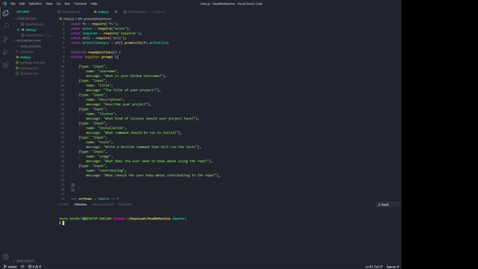

# Readme Gen
[]

## Description
  This application generates ReadMe.md files

  ## Table of Contents
  *[Installation](#installation)
  *[Usage](#usage)
  *[License](#license)
  *[Contributing](#contributing)
  *[Tests](#tests)
  *[Questions](#questions)
  
## Installation
To install run in the terminal:
npm i

## Usage
Used to generate ReadMe files

## License
This project is licensed under the license.

## Contributing
No contributors 

## Tests
Run the command:
npm test

## Questions

For questions or concerns contact me at
[Jerry-Seinfeld]https://github.com/Jerry-Seinfeld

  